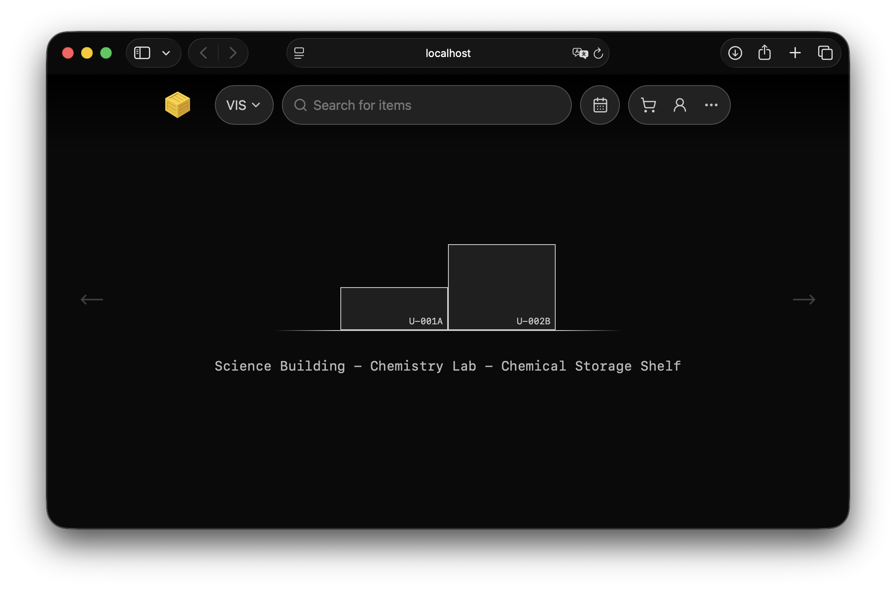

# Lagertool



An intuitive tool to organize inventory in buildings > rooms > shelves > elements > items. Built as a full-stack inventory management system for tracking physical items, managing borrow requests, and organizing storage across multiple locations. Designed for organisations that need to manage equipment lending with approval workflows, real-time availability tracking, and an AI-powered item categorization service.

## Table of Contents

- [Key Features](#key-features)
- [Architecture](#architecture)
- [Tech Stack](#tech-stack)
- [Project Structure](#project-structure)
- [Getting Started](#getting-started)
- [API Overview](#api-overview)
- [License](#license)

## Key Features

**Inventory & Location Management**
- Hierarchical location model: Organisation > Building > Room > Shelf > Column > Shelf Unit
- Track both consumable (supplies) and non-consumable (equipment) items
- Real-time availability based on active loans and date ranges
- Drag-and-drop shelf visualization with interactive UI

**Borrow Request Workflow**
- Shopping cart with multi-item checkout that generates formal borrow requests
- Multi-state approval pipeline: `pending` > `approved` / `rejected`
- Loan lifecycle tracking: `future` > `onLoan` > `returned` / `overdue`
- In-app messaging between borrowers and administrators

**Search & Discovery**
- Fuzzy search powered by Levenshtein distance matching
- Multi-tier results ranked by edit distance for flexible name lookup

**AI-Powered Item Categorization** *(standalone service, not yet integrated)*
- Python microservice that uses embeddings to find the closest WordNet word, then traverses the WordNet graph to find a common ancestor category
- Batch-processes inventory items to generate accurate category labels
- Runs fully offline with no external API dependencies

**Authentication & Access Control**
- EduID (OIDC/OAuth2) integration for institutional single sign-on
- Per-organisation admin roles with session management

## Architecture

```
        +-----------+
        |  Frontend |  React / TypeScript / Vite
        |  (SPA)    |  Zustand state, shadcn/ui, TailwindCSS
        +-----+-----+
              |
              | REST / JSON
              |
        +-----v-----+
        |  Backend  |  Go / Gin
        |  API      |  Swagger/OpenAPI docs
        +--+-----+--+
           |     |
     +-----+     +------+
     |                  | REST / JSON
+----v-------+   +------v--------------+
| PostgreSQL |   |  Description Gen    |  Python
|  (Data)    |   |  (AI categorizer)   |  WordNet + embeddings
+------------+   +---------------------+
```

## Tech Stack

| Layer | Technology |
|---|---|
| **Frontend** | React 19, TypeScript, Vite, TailwindCSS, Zustand, shadcn/ui (Radix UI), TanStack Table, Framer Motion, dnd-kit, React Router, Axios |
| **Backend** | Go 1.25, Gin, go-pg (PostgreSQL ORM), Swagger (swaggo/swag) |
| **Database** | PostgreSQL 15 |
| **AI Service** | Python 3.12+, WordNet, embeddings |
| **Auth** | EduID OIDC / OAuth2 |
| **Infrastructure** | Docker, Docker Compose, Nginx |

## Project Structure

```
lagertool/
├── backend/                # Go API server
│   ├── main.go             # Entry point & Swagger annotations
│   ├── api/                # Route definitions & handlers
│   ├── db/                 # Database connection & initialization
│   ├── db_models/          # ORM models (PostgreSQL schema)
│   ├── docs/               # Auto-generated Swagger/OpenAPI specs
│   ├── Dockerfile
│   └── docker-compose.yml
│
├── frontend/               # React SPA
│   ├── src/
│   │   ├── pages/          # Route pages (Home, Search, Cart, Requests, ...)
│   │   ├── components/     # UI components (NavBar, Shelves, DataTable, ...)
│   │   ├── hooks/          # Custom hooks for data fetching & mutations
│   │   ├── store/          # Zustand state stores (cart, org, date)
│   │   ├── types/          # TypeScript interfaces
│   │   ├── api/            # Axios HTTP client wrappers
│   │   └── App.tsx         # Router & layout
│   ├── Dockerfile
│   └── nginx.conf          # SPA routing for production
│
├── description_gen/        # AI categorization microservice
│   ├── app/                # FastAPI/Flask service
│   └── models/             # Local GGUF model files
│
└── .github/workflows/      # CI/CD pipeline
```

## Getting Started

### Prerequisites

- **Docker** & **Docker Compose**
- **Go** 1.25+
- **Node.js** 22+ / **npm**

### First time only: Configure DB credentials and app port

```bash
cp backend/.env.example backend/.env
```

### Reset databases

```bash
./scripts/reset_all_databases.sh
```

### Run everything (dev mode)

```bash
./scripts/run_all.dev.sh
```

This starts PostgreSQL via Docker Compose, the Go backend, the Python description service, and the Vite dev server. Ctrl+C shuts everything down cleanly.


### Running tests

```bash
cd backend
go test ./...
```

## API Overview

The backend exposes a RESTful API documented with Swagger. Key resource groups:

| Resource | Endpoints | Description |
|---|---|---|
| **Organisations** | `GET/POST /organisations` | CRUD for organisations |
| **Locations** | `GET/POST .../buildings`, `.../rooms`, `.../shelves` | Nested location hierarchy |
| **Inventory** | `GET/POST/PUT /organisations/:orgId/items/:id` | Item management with date-range availability |
| **Cart** | `GET/POST/DELETE /users/:userId/cart/items`, `POST .../checkout` | Shopping cart & checkout |
| **Requests** | `PUT /requests/:id`, `POST .../review`, `GET/POST .../messages` | Borrow request lifecycle |
| **Search** | `GET /search/:searchTerm` | Fuzzy find across inventory |
| **Auth** | `GET /auth/eduid/login`, `.../callback` | EduID OIDC flow |

## License

This project is licensed under the [GNU Affero General Public License v3.0](LICENSE).
