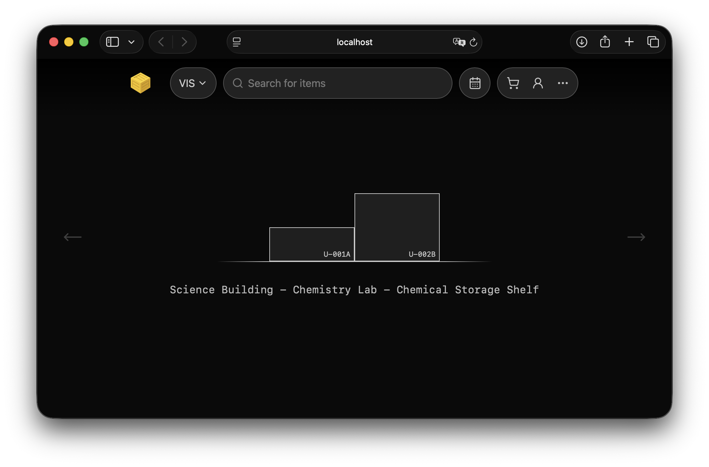

# Lagertool



An intuitive tool to organize inventory in buildings > rooms > shelves > elements > items. Built as a full-stack inventory management system for tracking physical items, managing borrow requests, and organizing storage across multiple locations. Designed for organisations that need to manage equipment lending with approval workflows, real-time availability tracking, and an AI-powered item categorization service.

## Table of Contents

- [Key Features](#key-features)
- [Architecture](#architecture)
- [Tech Stack](#tech-stack)
- [Project Structure](#project-structure)
- [Getting Started](#getting-started)
- [Authentication](#authentication)
- [API Overview](#api-overview)
- [License](#license)

## Key Features

**Inventory & Location Management**
- Hierarchical location model: Organisation > Building > Room > Shelf > Column > Shelf Unit
- Track both consumable (supplies) and non-consumable (equipment) items
- Real-time availability based on active loans and date ranges
- Shelf builder for arbitrary shelf sizes, with edit history and drag-and-drop

**Borrow Request Workflow**
- Shopping cart with multi-item checkout that creates one borrow request per organisation
- Instant checkout of a single item, without going through the cart
- Approval pipeline: `pending` > `approved` / `rejected`, reviewed by admins
- Loan lifecycle tracking: `future` > `onLoan` > `returned` / `overdue`
- In-app messaging between borrowers and administrators

**Search & Discovery**
- Fuzzy search powered by Levenshtein distance matching
- Multi-tier results ranked by edit distance for flexible name lookup

**AI-Powered Shelf Descriptions**
- Python microservice that compares the items in a shelf unit against a fixed list of categories using embeddings
- The backend regenerates a shelf unit's description automatically when items are added, edited or moved (admins can also trigger it manually)
- Runs fully offline with no external API dependencies

**Authentication & Access Control**
- Login via VSETH Keycloak (OIDC with PKCE), session cookie, automatic token refresh
- Admin rights derived from Keycloak roles; admins get rights for all organisations
- Users only see and change their own cart, requests and messages; reviewing requests and managing inventory is admin only
- Revoked Keycloak access and role changes take effect within one token lifetime

## Architecture

```
        +-----------+
        |  Frontend |  React / TypeScript / Vite
        |  (SPA)    |  Zustand state, shadcn/ui, TailwindCSS
        +-----+-----+
              |
              | REST / JSON + session cookie
              |
        +-----v-----+          +------------------+
        |  Backend  |  <-----> |  VSETH Keycloak  |  OIDC login,
        |  API      |   OIDC   |  (identity)      |  roles
        +--+-----+--+          +------------------+
           |     |  Go / Gin, Swagger/OpenAPI docs
     +-----+     +------+
     |                  | REST / JSON
+----v-------+   +------v--------------+
| PostgreSQL |   |  Description Gen    |  Python
|  (Data)    |   |  (AI categorizer)   |  Embeddings
+------------+   +---------------------+
```

## Tech Stack

| Layer | Technology |
|---|---|
| **Frontend** | React 19, TypeScript, Vite, TailwindCSS, Zustand, shadcn/ui (Radix UI), TanStack Table, Framer Motion, dnd-kit, React Router, Axios |
| **Backend** | Go 1.25, Gin, go-pg (PostgreSQL ORM), Swagger (swaggo/swag) |
| **Database** | PostgreSQL 15 |
| **AI Service** | Python 3.12+, FastAPI, embeddings |
| **Auth** | VSETH Keycloak, OIDC / OAuth2 (authorization code + PKCE) |
| **Infrastructure** | Docker, Docker Compose, Nginx |

## Project Structure

```
lagertool/
├── backend/                # Go API server (see backend/README.md)
│   ├── main.go             # Entry point & general Swagger info
│   ├── api/                # Route definitions & handlers
│   ├── auth/               # Keycloak login, sessions, admin roles
│   ├── api_objects/        # Request/response types
│   ├── db/                 # Database connection, migrations, queries
│   ├── db_models/          # ORM models (PostgreSQL schema)
│   ├── config/             # Environment configuration
│   ├── util/               # Fuzzy search, description service client
│   ├── docs/               # Auto-generated Swagger/OpenAPI specs
│   ├── Dockerfile
│   └── docker-compose.yml  # PostgreSQL (dev + test database)
│
├── frontend/               # React SPA
│   ├── src/
│   │   ├── pages/          # Route pages (Home, Search, Cart, Requests, ...)
│   │   ├── components/     # UI components (NavBar, Shelves, DataTable, ...)
│   │   ├── hooks/          # Custom hooks for data fetching & mutations
│   │   ├── store/          # Zustand state stores (cart, org, date, logged-in user)
│   │   ├── types/          # TypeScript interfaces
│   │   ├── api/            # Axios HTTP client wrappers
│   │   └── App.tsx         # Router, layout, login state
│   ├── Dockerfile
│   └── nginx.conf          # SPA routing for production
│
├── description_gen/        # AI categorization microservice (FastAPI)
│
├── scripts/                # Dev scripts (run everything, reset databases)
└── .github/workflows/      # CI/CD pipeline
```

## Getting Started

### Prerequisites

- **Docker** & **Docker Compose**
- **Go** 1.25+
- **Node.js** 22+ / **npm**
- **uv** (for the Python description service)

### First time only

```bash
cp backend/.env.example backend/.env    # then fill in, see below
(cd frontend && npm ci)
```

Auth is **on by default**. Either configure Keycloak in `backend/.env`:

```env
VSETH_CLIENT_ID=...                 # from VSETH
VSETH_CLIENT_SECRET=...
SESSION_SECRET=...                  # openssl rand -base64 32
TOKEN_ENCRYPTION_KEY=...            # openssl rand -base64 32 (a different one)
```

or, for local development without Keycloak, disable it:

```env
USING_AUTH=false                    # every request acts as the dev user (DEV_USER_ID, default 1) with admin rights
```

See [Authentication](#authentication) and `backend/.env.example` for all options.

### Reset databases

```bash
./scripts/reset_all_databases.sh
```

This recreates the databases and inserts test data (user 1, an organisation "VIS", a shelf and an item).

### Run everything (dev mode)

```bash
./scripts/run_all.dev.sh
```

This starts PostgreSQL via Docker Compose, the Go backend, the Python description service, and the Vite dev server. Ctrl+C shuts everything down cleanly.

- Frontend: http://localhost:5173
- Backend: http://localhost:8000
- Swagger UI: http://localhost:8000/swagger/index.html

### Running tests

The API tests need the test database (`test-db` in `backend/docker-compose.yml`, port 5435), which `run_all.dev.sh` starts.

```bash
cd backend
go test ./...
```

## Authentication

1. The frontend asks `GET /me` on startup. A `401` shows the login page.
2. "Login" navigates to `/auth/eduid/login`, which redirects to Keycloak. After login, Keycloak redirects to `/auth/eduid/callback`; the backend creates the user, reads their roles, sets an HttpOnly `user_session` cookie and redirects back to `FRONTEND_URL`.
3. The frontend sends the cookie with every request (`axios.defaults.withCredentials = true`). CORS only allows the origins in `FRONTEND_URL`.
4. "Logout" (`/auth/eduid/logout`) ends the session and the Keycloak login.

**Admin rights** come from the Keycloak roles listed in `AUTH_ADMIN_ROLES` (`client:role` pairs, default `member-api:admin` until VSETH provides a `lagertool` role). They are re-read on every login and token refresh.

| Variable | Purpose |
|---|---|
| `USING_AUTH` | `false` disables auth (local dev only). Default: on |
| `VSETH_CLIENT_ID`, `VSETH_CLIENT_SECRET` | Keycloak client of this app |
| `OIDC_ISSUER_URL` | Keycloak realm (default: the VSETH test realm `keycloak-fake`) |
| `OIDC_REDIRECT_URL` | Callback URL registered in Keycloak |
| `OIDC_POST_LOGOUT_REDIRECT` | Where Keycloak sends the browser after logout |
| `FRONTEND_URL` | Redirect after login; allowed CORS origins (comma-separated) |
| `AUTH_ADMIN_ROLES` | Keycloak roles that grant admin rights |
| `SESSION_SECRET` | Signs the login-flow cookie |
| `TOKEN_ENCRYPTION_KEY` | Encrypts stored Keycloak tokens |
| `COOKIE_DOMAIN`, `COOKIE_SECURE` | Cookie attributes |
| `DEV_USER_ID` | User to act as when auth is off |

## API Overview

The backend exposes a RESTful API documented with Swagger (http://localhost:8000/swagger/index.html). Key resource groups:

| Resource | Endpoints | Description |
|---|---|---|
| **Me** | `GET /me`, `GET /me/borrow_requests` | The logged-in user and their requests |
| **Cart** | `GET/POST/PUT/DELETE /me/cart/items`, `POST /me/cart/checkout`, `POST /me/checkout` | Own shopping cart, checkout, instant checkout |
| **Organisations** | `GET /organisations` | List organisations |
| **Locations** | `GET/POST .../buildings`, `.../rooms`, `.../shelves` | Nested location hierarchy (create: admin) |
| **Inventory** | `GET/POST/PUT /organisations/:orgId/items/:id` | Items with date-range availability (create/edit: admin) |
| **Requests** | `GET /borrow_requests`, `POST /requests/:id/review`, `GET/POST /requests/:id/messages` | Borrow request lifecycle (all requests and review: admin) |
| **Loans** | `PUT /loans/:id`, `PUT /requests/:id/loans` | Mark loans returned (admin) |
| **Descriptions** | `POST /shelf-units/:id/regenerate-description` | Regenerate shelf descriptions (admin) |
| **Search** | `GET /search/:searchTerm` | Fuzzy find across inventory |
| **Auth** | `GET /auth/eduid/login`, `.../callback`, `.../logout` | Keycloak OIDC flow |

## License

This project is licensed under the [GNU Affero General Public License v3.0](LICENSE).
